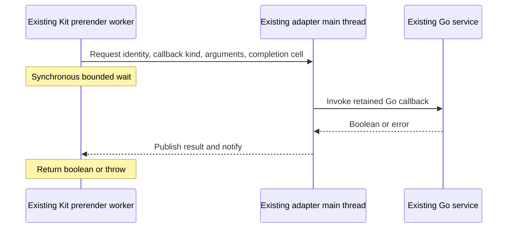

# Prerender predicates: simplest correct design

Design discussion; no RequestEvent implementation before #262. This proposal revisits the synchronous-predicate mechanism in [the RequestEvent plan](20261006-request-event.md), not the requirement that Go owns application decisions. The user requested alternating edits and commits with Claude Fable 5.1 until both authors endorse simplicity and correctness. Agreement is about the design; real-build acceptance remains implementation work.

## Codex opening proposal

**Reuse the existing adapter main thread. Do not create a predicate worker.** Kit's prerender worker invokes the synchronous callback, sends its arguments to the adapter owner, and waits for a shared result. The adapter owner asynchronously calls the existing Go service and writes the boolean or failure into that result. Normal Kit defaults require no bridge calls.

The owner establishes a build-scoped BroadcastChannel before prerender starts. The generated hook knows its channel from the build environment. Each predicate call posts the logical request identity, callback kind and arguments, plus a small SharedArrayBuffer completion cell. The owner calls Go using its existing asynchronous service transport. An atomic status distinguishes pending, false, true and failure; publish the status before notifying. A bounded Atomics.wait plus an atomic load handles an answer that arrived before waiting. Failures throw and fail the build; they never become false or true. Keep error transport small; the owner can retain the detailed diagnostic while the renderer reports the failed callback/request. Close the channel with the existing owner's cleanup. An owner-registration failure or a dead service cannot leave an unbounded waiter.

The actual callback still executes once for each invocation Kit makes, against the retained logical request. The Go hook is suspended in resolve but the service can dispatch the callback. No callback result memoization and no speculative callback invocation. Application work remains in Go. Kit's worker pauses during the round trip, including its other in-flight renders; that is a real scheduling consequence but its build-time impact is unmeasured. Do not claim a performance crisis without measuring it.

### Evidence and assumptions

- Installed Kit package is 3.0.0. `src/utils/fork.js` runs prerendering in a Worker while its caller waits on a Promise. The adapter's `createPrerenderOwner` in `internal/adapter/skgo-adapter/prerender.js` is main-thread-only; `internal/adapter/skgo-adapter.js` prepares it before Kit prerenders.
- Kit `src/runtime/server/page/render.js` invokes preload for assets; `serialize_data.js` invokes the header filter during serialization; `load_data.js` also invokes that filter synchronously when universal code reads certain response headers. The latter makes an async-only proxy insufficient even if serialization were changed.
- Go `document_fetch.go:fetchHeaders` already computes header decisions at fetch time and `internal/adapter/skgo-adapter/entry.js:resolve_options` replays them through a set. This is evidence for a simpler data-transfer alternative, not proof that moving callback evaluation preserves every legal closure's behavior.
- Node supports BroadcastChannel and shared memory across workers. Integration with the actual build owner still needs real-build validation. This proposal assumes the owner event loop stays able to service async callbacks while Kit's worker waits; verify the complete startup and shutdown topology before implementation.

## Competing ideas worth defending

| Candidate | Attraction | Correctness or complexity question |
| --- | --- | --- |
| Return header decisions alongside Go fetch responses | Already used at runtime; no extra round trip for each header | Can change timing/count for callbacks that read mutable request state; cover every fetch path and header access, including repeated set-cookie values. |
| Batch preload decisions from known build assets | Finite asset set; local JS lookup | Exact candidate set and invocation phase belong to Kit. Speculative calls or early evaluation can differ for stateful callbacks. |
| Synchronous pipe to the existing Go process | Direct boolean RPC without a Node relay | Public portable Node APIs, handle ownership in Kit's worker, bounded blocking reads, and Windows support may outweigh the saved relay. |
| Keep a separate predicate worker | General synchronous bridge | Adds a lifecycle although an independent main-thread event loop already exists. Justify only if the existing owner cannot serve the calls. |
| Render prerendered pages through our Go runtime | Callbacks stay in Go as at runtime | Changes who owns crawling/rendering/artifacts and requires build-order analysis; much broader than the predicate problem. |

No candidate is excluded merely because it differs from the opening proposal. The winning design should preserve Kit's observable behavior without collecting speculative machinery. If an alleged semantic requirement exceeds Kit or our established contract, challenge it with evidence too.

## Acceptance of the eventual implementation

A real Kit build exercises both true and false decisions for each custom predicate, checking literal included/excluded assets and headers. Exercise request-local callback state at relevant phases so an eager lookup cannot accidentally pass as equivalent. Defaults require no predicate service requests. Service/owner failure ends the build within the existing timeout policy and cleanup owns every added resource. This is ordinary integration verification, not a new proof framework. Until those tests run, agreement here establishes a design, not working runtime behavior.

## Turns

- Codex turn 1: main-thread relay is the best general candidate I have. Its chief advantage is preserving arbitrary callback behavior while adding only a channel and bounded completion cell to resources we already own. I invite a smaller solution that preserves the actual contract, or evidence that this topology cannot work.
