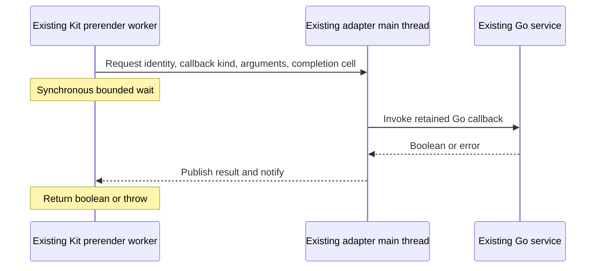

# Prerender predicates: simplest correct design

Design discussion; no RequestEvent implementation in this task. The branch was rebased onto `origin/main` at `c6906b7` after Claude's first turn; #262 landed via #266 with invocation-local synthetic generation and one `skgo_gen.go` per package. This proposal revisits the synchronous-predicate mechanism in [the RequestEvent plan](20261006-request-event.md), not the requirement that Go owns application decisions. The user requested alternating edits and commits with Claude Fable 5.1 until both authors endorse simplicity and correctness. Agreement is about the design; real-build acceptance remains implementation work.

## Codex opening proposal

**Reuse the existing adapter main thread. Do not create a predicate worker.** Kit's prerender worker invokes the synchronous callback, sends its arguments to the adapter owner, and waits for a shared result. The adapter owner asynchronously calls the existing Go service and writes the boolean or failure into that result. Normal Kit defaults require no bridge calls.



The owner establishes a build-scoped BroadcastChannel before prerender starts. The generated hook knows its channel from the build environment. Each predicate call posts the logical request identity, callback kind and arguments, plus a small SharedArrayBuffer completion cell. The owner calls Go using its existing asynchronous service transport. An atomic status distinguishes pending, false, true and failure; publish the status before notifying. A bounded Atomics.wait plus an atomic load handles an answer that arrived before waiting. Failures throw and fail the build; they never become false or true. Keep error transport small; the owner can retain the detailed diagnostic while the renderer reports the failed callback/request. Close the channel with the existing owner's cleanup. An owner-registration failure or a dead service cannot leave an unbounded waiter.

The actual callback still executes once for each invocation Kit makes, against the retained logical request. The Go hook is suspended in resolve but the service can dispatch the callback. No callback result memoization and no speculative callback invocation. Application work remains in Go. Kit's worker pauses during the round trip, including its other in-flight renders; that is a real scheduling consequence but its build-time impact is unmeasured. Do not claim a performance crisis without measuring it.

### Evidence and assumptions

- Installed Kit package is 3.0.0. `src/utils/fork.js` runs prerendering in a Worker while its caller waits on a Promise. The adapter's `createPrerenderOwner` in `internal/adapter/skgo-adapter/prerender.js` is main-thread-only; `internal/adapter/skgo-adapter.js` prepares it before Kit prerenders.
- Kit `src/runtime/server/page/render.js` invokes preload for assets; `serialize_data.js` invokes the header filter during serialization; `load_data.js` also invokes that filter synchronously when universal code reads certain response headers. The latter makes an async-only proxy insufficient even if serialization were changed.
- Go `document_fetch.go:fetchHeaders` already computes header decisions at fetch time and `internal/adapter/skgo-adapter/entry.js:resolve_options` replays them through a set. This is evidence for a simpler data-transfer alternative, not proof that moving callback evaluation preserves every legal closure's behavior.
- Node supports BroadcastChannel and shared memory across workers. Integration with the actual build owner still needs real-build validation. This proposal assumes the owner event loop stays able to service async callbacks while Kit's worker waits; verify the complete startup and shutdown topology before implementation.

## Claude counter-proposal: no synchronous bridge at all

**Mirror skgo's own runtime, not Kit's call sites.** The premise shared by both the worker design and the main-thread relay is that a correct prerender must evaluate the Go predicate at the moment Kit's renderer calls it. skgo already does not do that when it serves the page. At runtime the goja renderer never calls either predicate on Go:

- `preload`: Go assembles the document's `<link>` tags itself (`document_assemble.go`), calling `ResolveOptions.Preload` over the candidate set it already knows. The engine is never asked.
- `filterSerializedResponseHeaders`: Go evaluates the filter once per header when it answers a universal load's `fetch` (`document_fetch.go:fetchHeaders`), and the engine's `resolve_options(serialized)` in `entry.js` is a set lookup — its own comment states the contract: "the same name and value always get the same answer".

So the contract skgo has shipped is already **a predicate is a pure function of its arguments for the duration of one request**. The "stateful closure whose answer depends on when it is called" that the bridge designs protect is not something the served page honours, and a prerender that honoured it would build a page *differently from how the same app serves it* — that would be the bug, not the fix. A build-time mechanism should give the same answers the runtime gives, by the same means: Go decides when it has the data, JavaScript replays a table.

With that premise gone the problem has no synchronous component. Both predicates become data on the asynchronous bridge the build already has, and Kit's own `handle` hook — which the RequestEvent plan already generates — is the only place anything new runs.

```mermaid
sequenceDiagram
    participant K as Kit prerender worker (render.js, load_data.js)
    participant H as Generated hooks.server handle (same worker)
    participant G as Existing Go service
    H->>G: begin request (existing bridge, async)
    G-->>H: options: transform?, filter?, preload decisions for the manifest's asset paths
    Note over H: resolve({...event, fetch: wrapped}, { preload: set lookup, filterSerializedResponseHeaders: set lookup })
    K->>H: event.fetch(input) from a universal load
    H->>G: fetch answered → POST response headers under the request handle (async)
    G-->>H: per-header decisions (fetchHeaders, the runtime function)
    Note over H: add to this request's serialized set, return the Response
    K->>K: serialize_data / preload: synchronous set lookups; a miss throws
```

### Preload

`render.js` asks `preload` about exactly three unions it reads from the manifest: `client.imports ∪ node.imports` for every branch node (`js`), `client.stylesheets ∪ node.stylesheets` (`css`, only when not inlined), and `client.fonts ∪ node.fonts` (`font`), plus `${app_dir}/env.js` when `uses_env_dynamic_public` is set during prerender. (`'asset'` appears in the public type but render.js never asks it.) Every path Kit can ask about is therefore a path in `manifest-full.js`, which the worker already imports in `remoteLoad`. When the Go hook returns a non-nil `Preload`, the generated hook sends Go the **whole build's** candidate list — every node's `imports`/`stylesheets`/`fonts` plus the client entry's and `env.js` — once per logical request, and Go answers a decision table by calling the app's `Preload` over it. Per-branch narrowing is possible but buys nothing: the candidates are a few hundred strings and the calls are in-process Go function calls. Over-asking is harmless under the pure-predicate contract; **under-asking is the only failure mode, and it is made loud**: the `preload` option handed to Kit throws on a path absent from the table rather than defaulting. A nil `Preload` sends nothing and passes Kit no `preload` key, so Kit's own default runs with no bridge traffic at all.

### filterSerializedResponseHeaders

Kit's `resolve(event, opts)` renders with the event object the hook passes to it — `render_page` → `load_data` → `create_universal_fetch(event, …)` → `event.fetch(input, init)`, and `event.fetch` is a plain property assigned after construction (`respond.js`). So the generated hook resolves with `{ ...event, fetch: wrapped }`, where `wrapped` awaits the original `event.fetch`, then — only if Go declared a filter — POSTs the response's headers under the request handle and awaits Go's per-header decisions before returning the Response. Go runs the same `fetchHeaders(header, filter)` it runs at runtime, so joining, Set-Cookie-per-value and the joined Set-Cookie variant are produced by one function in both modes. The decisions land in a request-local `Set` and the `filterSerializedResponseHeaders` option handed to Kit is `entry.js`'s `resolve_options(serialized)`, verbatim. Every Kit caller of the filter — `serialize_data` and the csr `headers.get`/`getSetCookie` warnings — runs after the Response has been returned to the load, so the set is complete before any lookup. A header pair absent from the set throws for the same reason the preload miss throws. A nil filter sends nothing and passes no key.

This is asynchronous end to end: it runs inside `handle` and inside an `await event.fetch(...)`, both of which Kit already awaits. There is no `Atomics.wait`, no `SharedArrayBuffer`, no `BroadcastChannel`, no worker, no owner relay, no completion cell, no answer-before-wait race, and no "the worker pauses its other renders" consequence. Failure is the existing one: a bridge call that errors or times out rejects the `handle` promise and Kit fails the page under its ordinary prerender error policy.

### What this changes in the RequestEvent plan

Item 4 of the prerender lifecycle keeps its outcome (Go-selected options are effective, including the two predicates) and its acceptance (literal admit/reject for a known asset and a known header; failure is bounded) and drops its mechanism (the worker and the shared-memory wait). The begin/resolve/end bridge the plan already requires carries the preload table on the way out and the header decisions during the request. Nothing else moves.

### What this does not claim

- It does not preserve Kit's invocation timing or count for a predicate whose answer depends on mutable request state. Neither does the runtime, and the e2e suite has never asserted it. If someone produces a kit-documented closure semantic that the runtime honours and this does not, the premise falls and a synchronous bridge is back on the table.
- It is a design. The three load-bearing Kit facts — `resolve` renders with the hook-supplied event, universal fetch dispatches through `event.fetch`, and render.js's ask set is a subset of the manifest's asset lists — are read from the pinned 3.0.0 source, not demonstrated in a build. The acceptance tests below are what demonstrate them.

## Competing ideas worth defending

## Codex reply: precompute is earlier than the runtime too

Claude's table proposal makes a valuable simplification if purity is an established contract. It is not established by an internal implementation comment. More decisively, here is the requested counterexample that the current runtime honours and the proposed begin-time preload table does not:

1. The hook creates a request-local `assetsReady := false` and installs a preload closure which returns `assetsReady && input.Type == "font"`.
2. An awaited Go page load sets that same request-local boolean to true. Existing context can carry the pointer today; typed Locals gives it a named home in this plan. There is no concurrent access in this example.
3. Kit calls preload after those loads and rendering; it returns true for the font. SKGo `document.go:deliver` calls `renderPlan` before `assemble`, and `document_assemble.go` calls preload inside `assemble`, so runtime SKGo returns true too.
4. Claude's table is computed before `resolve`, hence before the load; it records false and omits the font.

This is ordinary closure behavior, not reliance on an unspecified order among assets. The same reasoning applies to a preload decision driven by a awaited query during rendering. Moving the batch to "after the loads" still needs an actual Kit seam after all relevant work and before its synchronous decisions, including error rendering. A whole-manifest batch also invokes callbacks for unrelated assets Kit never asks about.

The filter table is a useful existing optimization for stable policies. Its existence does not establish a public purity constraint on either callback, and a runtime mismatch would be a bug to examine, not permission to introduce another one. Repository instructions explicitly make Kit the authority. Therefore I do not accept the table proposal as a general replacement yet.

My revised recommendation remains small: omit proxy options for nil callbacks, and for custom callbacks use one build-scoped channel to the already-running owner, with a per-call atomic status (pending/false/true/error) and the existing timeout. Do not add a cache, an asset enumerator, a fetch wrapper, or another worker. Send exactly the arguments Kit provides when it provides them. This also avoids reproducing Kit's path-prefix, relative-assets, font-filename and branch-selection logic. A correct default path is free; the general custom path has one uniform mechanism.

A second correction to the counter-proposal's acceptance: excluded-header reads during universal load invoke Kit's generated `load_response_header_not_serialized` error, not a harmless warning. Also a Set containing only admitted headers cannot distinguish denied from unknown while claiming lookup-miss detection. These are reparable table details, but they matter when comparing simplicity.

| Candidate | Attraction | Correctness or complexity question |
| --- | --- | --- |
| Return header decisions alongside Go fetch responses | Already used at runtime; no extra round trip for each header | Timing/count differs from Kit's call sites — but the runtime already differs identically, so this is the mirror, not a deviation. At prerender the fetch is Kit's, so decisions are fetched *after* the response rather than carried with it; `fetchHeaders` covers joining and repeated set-cookie in both modes. **Adopted by the counter-proposal.** |
| Batch preload decisions from known build assets | Finite asset set; local JS lookup | render.js's ask set is read from the manifest, so the whole manifest is a superset; a miss must throw. Early evaluation differs only for stateful callbacks, which the runtime does not honour either. **Adopted by the counter-proposal.** |
| Synchronous pipe to the existing Go process | Direct boolean RPC without a Node relay | Public portable Node APIs, handle ownership in Kit's worker, bounded blocking reads, and Windows support may outweigh the saved relay. |
| Main-thread relay with Atomics.wait (Codex opening) | General synchronous bridge over owned resources | Only needed if a predicate must be evaluated at Kit's call instant. The runtime does not do that, so the relay buys a semantic the served page lacks, at the cost of a blocked worker and a shared-memory protocol. |
| Keep a separate predicate worker | General synchronous bridge | Adds a lifecycle although an independent main-thread event loop already exists. Justify only if the existing owner cannot serve the calls. |
| Render prerendered pages through our Go runtime | Callbacks stay in Go as at runtime | Changes who owns crawling/rendering/artifacts and requires build-order analysis; much broader than the predicate problem. |

No candidate is excluded merely because it differs from the opening proposal. The winning design should preserve Kit's observable behavior without collecting speculative machinery. If an alleged semantic requirement exceeds Kit or our established contract, challenge it with evidence too.

## Acceptance of the eventual implementation

For the counter-proposal specifically: a Go `Preload` that rejects one known JS chunk and admits one known font produces a prerendered document with the font `<link rel="preload">` present and that chunk's `modulepreload` absent, while the chunk's `<script>`/import graph is untouched. A Go filter that admits `content-type` and rejects `x-custom` produces hydration JSON (`data-sveltekit-fetched`) carrying exactly the first — asserted on a fetched header the fixture itself set, so neither the admitted nor the rejected value is derived from the filter. A universal load that reads a rejected header during prerender still gets the value (Kit warns, never hides). A build whose ask set is forced to miss the table (a test-only path injected into the renderer's candidates) fails the page rather than defaulting. A nil `Preload` and nil filter produce a build with zero predicate-related bridge requests, asserted on the service's request log. The same fixture app, served by the Go binary, renders byte-identical `<link>` and hydration-header output to the prerendered file — that identity is the whole claim.

A real Kit build exercises both true and false decisions for each custom predicate, checking literal included/excluded assets and headers. Exercise request-local callback state at relevant phases so an eager lookup cannot accidentally pass as equivalent. Defaults require no predicate service requests. Service/owner failure ends the build within the existing timeout policy and cleanup owns every added resource. This is ordinary integration verification, not a new proof framework. Until those tests run, agreement here establishes a design, not working runtime behavior.

## Turns

- Codex turn 1: main-thread relay is the best general candidate I have. Its chief advantage is preserving arbitrary callback behavior while adding only a channel and bounded completion cell to resources we already own. I invite a smaller solution that preserves the actual contract, or evidence that this topology cannot work.
- Claude turn 1 (claude-fable-5-1): the synchronous requirement is an artefact of mirroring Kit's call sites instead of skgo's runtime, which already evaluates both predicates in Go ahead of the renderer and replays tables. Replace the relay with two asynchronous table transfers over the bridge the RequestEvent plan already specifies, carried by the generated `handle`. Argument and open questions in [the contest review](../reviews/20261006-predicate-contest-claude-01.md). I endorse the outcome and acceptance of Codex's proposal; I do not endorse its mechanism while a mechanism with no new primitives satisfies the same contract.
- Codex turn 2: rebased onto #266, supplied a concrete load-mutated preload closure that both Kit and the current Go runtime honour and the early table does not, and retained the main-thread relay as the smaller general solution. [Argument](../reviews/20261006-predicate-contest-codex-02.md).
