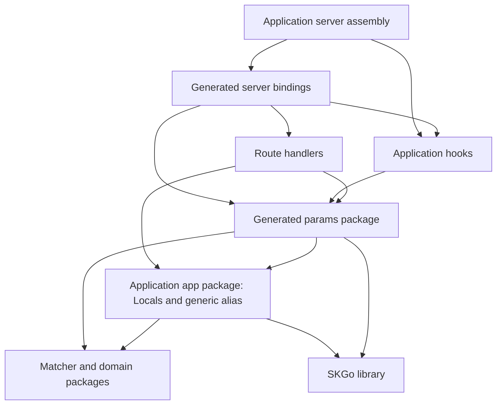
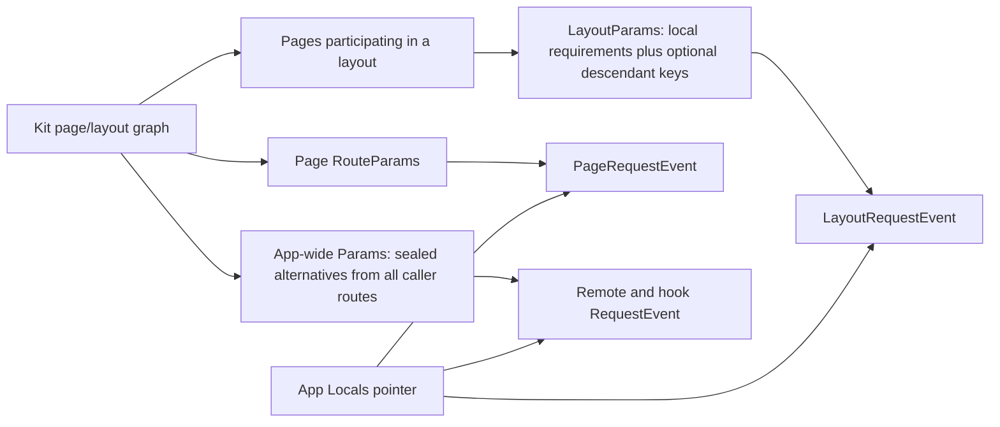

# Complete RequestEvent: typed locals, layout params, and request metadata

**Status:** initial design reviewed with Claude through round 05; the predicate mechanism is now being reconsidered in the [alternating design discussion](20261006-prerender-predicate-design.md). Codegen prerequisite [#262](https://github.com/tylergannon/skgo/issues/262) landed in [#266](https://github.com/tylergannon/skgo/pull/266). This task remains design-only.

**Baseline:** rebased onto SKGo `c6906b7` (merged #266, following typed params #261); installed SvelteKit **3.0.0**. This is a plan, not an implementation or a claim of runtime proof.

## Outcome

An application developer defines one editable `Locals` struct, initializes it in the request hook, and reads `event.Locals` from typed events. Page and layout loads receive params appropriate to their different route domains. Every event reports the request's route, normalized URL, kind, and client address wherever Kit permits it. Remote queries retain their caller-state restrictions.

The user has accepted keeping route identity separate from params, retaining `RouteID()` and its dependency tracking, reusing #261's sealed unions, and deferring platform/tracing. They want the hook to be able to assign the locals pointer. API spellings below are proposed decisions for this work, not existing APIs.

## Source of truth

Read the installed pin before implementation, and remap if the pin changes. The public [RequestEvent reference](https://svelte.dev/docs/kit/@sveltejs-kit#RequestEvent) is orientation; the package source below resolves behavior.

| Contract | Pinned source, relative to `example/web/node_modules/@sveltejs/kit/` |
| --- | --- |
| Event fields and server-load extensions | `types/index.d.ts`: `RequestEvent`, `ServerLoadEvent` |
| Fresh locals, matching, normalized URLs, request flags, address provider | `src/runtime/server/respond.js` |
| Layout membership including layout resets and route groups | `src/core/sync/create_manifest_data/index.js`: `child_pages` construction |
| Layout params and route-ID domains | `src/core/sync/write_types/index.js`: `LayoutParams`, `LayoutRouteId` |
| Per-load params/route tracking and untrack | `src/runtime/server/page/load_data.js` |
| Restricted remote events | `src/runtime/app/server/remote/shared.js`: `derive_remote_function_event` |
| Internal fetch creates a separate request | `src/runtime/server/fetch.js`, `src/runtime/server/state.js` |

The merged SKGo baseline has concrete route-local `RouteParams`, app-wide sealed-union `params.Params`, event aliases and constructors, and explicit command/form events. It does not generate `LayoutParams`. Its flags are hook-only; classic page actions lack the metadata that `URL()` and `RouteID()` read. Locals are currently a type-keyed context store. Client address exists internally for SSR, but has no public event accessor.

## 1. Public event and application ownership

The library owns the generic event:

```go
type RequestEvent[P, L any] struct {
    *Event
    Params P
    Locals *L
}
```

`skgo new` emits an ordinary, developer-owned `internal/app/locals.go`:

```go
package app

import "github.com/tylergannon/skgo"

type Locals struct{}

type RequestEvent[P any] = skgo.RequestEvent[P, Locals]
```

The alias can live immediately after `Locals`. Generation never rewrites this file. Add `LocalsPackage string` and `LocalsType string` to generation configuration. The CLI accepts `--locals-package <Go import path>` (required) and `--locals-type Locals` (default type name). The scaffold writes its real module import path into the generation directive. Checking uses the same configuration; there is no separate inferred locals type. One configured locals type applies to all registrations in that app. Different applications in the same process may use different types.

Select the application's hook once for runtime and build use: generation config adds optional `HookPackage` and `HookSymbol` (`--hook-package <Go import path>`, `--hook-symbol Handle`, default symbol `Handle`). When no hook package is selected, the generated binding uses a nil typed middleware. A selected symbol must be convertible to the generated `params.Middleware` signature. The scaffold creates an editable `internal/serverhooks/handle.go` with `var Handle params.Middleware`, and its generation directive selects it. Developers can assign a full hook or `params.Handle(before).Middleware()`, or a typed sequence. This package may import app/domain/shared params, but not the generated server bindings; generated bindings import the selected hook. The scaffolded hook variable may remain nil. This explicit package-and-symbol selection is the discovery mechanism: no hook marker or filename scan is added. No package means a nil hook; a selected missing symbol, wrong signature, or multiple configured selections is a generation error. Other unselected functions are irrelevant. The exported symbol has the underlying signature `func(context.Context, *params.RequestEvent, skgo.Resolve) (*http.Response, error)`; a function declaration or variable of that function type is accepted.

The configured type is a concrete named struct. Its fields may contain ordinary server-only Go resources; locals are never projected through Polytype or serialized automatically. Library code never imports an application's package.



Arrows are imports. `app` and its transitive dependencies must not import routes, generated params, or server bindings. A hook that imports shared params therefore lives outside `app` and outside any matcher package imported by generated params. In particular, putting that hook beside matchers in `web/src` would create `hooks → params → hooks`; keep it in a separate importable hooks package that does not import server assembly or generated bindings, even transitively. Server assembly is not a valid selected-hook location because it imports generated bindings. Preserve #261's leaf-package rules for matcher types. Validate violations with a useful import/dependency diagnostic. The scaffold's module-root server package is already named `app`; it imports `internal/app` as `appstate` where needed to avoid confusing the two packages. The route examples use the shorter `app` import name.

## 2. Locals lifecycle and hook assignment

The full hook receives a **pointer** to the app-wide typed event. Illustrative application code:

```go
func handle(ctx context.Context, event *params.RequestEvent,
    resolve skgo.Resolve) (*http.Response, error) {
    session, err := loadSession(ctx, event.Cookie)
    if err != nil { return nil, err }
    event.Locals = &app.Locals{Session: session}
    return resolve(ctx)
}
```

The `Session` field and `loadSession` are application examples, not scaffold requirements.

The library adds these typed hook APIs alongside its existing low-level hooks:

```go
type RequestMiddleware[P, L any] func(
    context.Context, *RequestEvent[P, L], Resolve,
) (*http.Response, error)

type RequestHandle[P, L any] func(context.Context, *RequestEvent[P, L]) error

func (h RequestHandle[P, L]) Middleware() RequestMiddleware[P, L]
func RequestSequence[P, L any](hooks ...RequestMiddleware[P, L]) RequestMiddleware[P, L]
func (h RequestMiddleware[P, L]) Intercept(
    cfg HandleConfig, makeParams func(*Event) (P, error), next http.Handler,
) http.Handler
func RequestLocals[L any](ctx context.Context) *L
```

These are declaration sketches; implementations are deferred. Shared `params` generates concrete `Middleware` and `Handle` function types, a `Sequence` wrapper, and `.Intercept(cfg skgo.HandleConfig, next http.Handler)` convenience methods. They delegate to these library APIs and supply their own generated hook-params constructor. The library never imports `params`. Existing raw `skgo.Handle`, `skgo.Middleware`, and `skgo.EventFrom(ctx) *Event` retain their low-level shapes; `EventFrom` is the permission-appropriate core event, not a typed wrapper and not a way to regain query caller state.

Low-level HTTP endpoints keep `net/http` signatures. Existing context-only query, action, error-hook, and fetch-hook signatures remain; they get typed locals through generated `app.LocalsFrom(ctx) *app.Locals`, delegating to `skgo.RequestLocals[Locals](ctx)`. Outside a bound request that helper returns nil; requesting a different locals type inside a bound request panics with a message naming the requested and configured Go types. The existing guarded hook/handler boundary reports it through `OnPanic` and its normal error response; never create an independent empty store.

The **typed Intercept is the single application binding boundary** for locals and client-address policy. Add `ClientAddress func(*http.Request) (string, error)` to `skgo.HandleConfig`. Generated server bindings expose `RequestBoundary(cfg skgo.HandleConfig, next http.Handler) http.Handler`, which supplies the selected hook through the shared params adapter. The scaffold and example use this boundary; with no selected hook it delegates to `params.Middleware(nil).Intercept(handleCfg, handlers)`. A nil typed hook still binds the request; unlike today's nil raw middleware it is not a pass-through. Loads/remotes/endpoints do not independently create locals. Low-level registry-only fixtures remain possible without a typed app, but a generated typed application must install this boundary. The before-only typed Handle runs its initializer then resolves. Keep original Handle only as a low-level API; do not invent old-locals-store compatibility for it.

Hook conversion uses the already matched route's converted params, not the remote-only caller accessor and not an additional matcher execution. The implementation must make that converted snapshot available at this boundary. A generated params-constructor failure indicating route/type drift is `callerManifestDrift` (503), serialized by the existing hook-refusal path (remote transport uses its error envelope). A genuine constructor programming error is a 500. Neither runs the application hook with partial params.

### Every application entry point uses this boundary

| Entry point | Required binding |
| --- | --- |
| Main production/dev HTTP handler | Generated `RequestBoundary` wraps the app's handler stack. Existing static-asset and upgrade bypass rules remain. |
| `FetchConfig.Handler` for Go server fetches | Dispatch through the bound app stack; fresh locals and one hook invocation for the subrequest. |
| `SSROptions.Fetch` for renderer/universal-load fetches | Dispatch through the same bound app stack, including in the starter. The current scaffold's bare endpoint handler is insufficient. |
| Generated prerender command | Bind each **logical Kit request**, run the same selected Go hook, and retain its locals for the complete request. The service's loopback callback POST is transport, not the application's event. |

There is no second locals allocator for these paths. An internal fetch starts a new binding and invokes the same hook; a derived event within an existing logical request does neither. The generated starter must wire both fetch entry points, not only the example app.

**Prerender is in scope.** Kit executes `handle` during prerender, so SKGo does too. Extend the service's public entry point with a required `PrerenderServiceOptions` value containing `BindRequest func(http.Handler) http.Handler`; the generated command supplies the same generated `RequestBoundary` with build-time `HandleConfig` and an unavailable-client-address provider. Build route metadata must supply matching information without requiring the final frontend manifest.

The build bridge must carry logical-request identity and lifetime. Layout, page, and remote callbacks belonging to one Kit request share one Go hook invocation and one Go locals object; separate callback POSTs must not each allocate or run the hook anew. SKGo owns a generated `src/hooks.server.ts` (or `.js` under JavaScript generation) whose `handle` forwards the build lifecycle to Go. The bridge may carry an opaque request handle but **never serialize Locals or move application I/O into JavaScript**. The selected Go middleware's resolve surrounds all callbacks for that logical request, with before/after execution once, existing header/cookie/redirect/error semantics, and completion/cancellation releasing request state only after callbacks and deferred work finish. State must not leak between concurrent prerenders or survive failed/cancelled builds.

The build bridge has these required public behavioral contracts; internal endpoint names and storage mechanisms remain the implementer's choice:

1. **Hook ownership and runtime behavior.** Generate the Kit `handle` export at the configured frontend language's `src/hooks.server` path with SKGo's ownership header. Outside `building`, it calls Kit's `resolve(event)` directly and performs no bridge I/O; the Go runtime boundary already owns the hook. During builds it orchestrates only forwarding, never application logic. Refuse an authored file at either conflicting hooks-server path rather than overwrite it or silently compose an unrelated handle. The current example and starter have no authored server hook to preserve. The current goja bundle loads universal hooks only, so this generated server-hook file is not bundled into the embedded runtime; do not add an engine-side bootstrap for it.
2. **Begin before resolve.** The generated Kit hook begins the Go logical request using the real Kit request metadata and build route graph. Before Node calls `resolve`, the Go hook must either enter its final resolve or answer/refuse. Begin returns as soon as final resolve is entered; it does not wait for that Go resolve call to return, which requires Node's response. Build-service connection information is available independently of `event.platform`; unmatched requests still begin a logical request and run the hook with an empty route ID even when Kit supplied no platform object. A Go redirect or HTTP error is converted to a typed bridge result and re-thrown through Kit's own `redirect`/`error`, preserving status/location/message; an arbitrary hook response is forwarded as a real Response and skips Node resolution. Bridge/internal failures abort or enter Kit's normal error path, never look like successful empty data.
3. **Resolve means the actual Kit response.** When the Go hook reaches resolve, Node is permitted to execute `resolve(event, options)`. The Go resolve call waits for that real response's status, headers and body stream, exposed as an `*http.Response`. The Go hook can then perform its normal after-logic and return a modified/wrapped response. The generated Kit hook returns that final Go-selected response to Kit's prerenderer. The prerenderer ultimately consumes the whole body, so transport buffering is an implementation choice, not an acceptance requirement. Cancellation, body errors and Close must still terminate outstanding work and release the logical request. This is transport of the actual response, not a synthesized 200 used merely to unblock the hook.
4. **ResolveOptions remain effective, including the two synchronous predicates.** Forward the Go-selected options to Kit before Node resolves. Kit awaits `transformPageChunk`, so its proxy uses the existing asynchronous bridge. Kit calls `preload(input)` synchronously after rendering, and `filterSerializedResponseHeaders(name, value)` during universal-load header reads and later serialization. Both require an actual boolean; returning a Promise would silently admit everything, and precomputing answers can precede state changes a closure depends on. Use the relay in [the predicate design](20261006-prerender-predicate-design.md): a non-nil callback posts the request handle and Kit's actual arguments on a build-scoped `BroadcastChannel` to the existing main-thread owner, which calls the existing Go service and posts the boolean or full error back. The worker waits on a one-word shared cell with the existing callback timeout and dequeues the answer with `receiveMessageOnPort`. Every bridge failure permanently fails the relay/build so a late reply cannot be reused by a later call. Nil callbacks pass no option and cause no traffic. The Go service dispatches against the suspended request's composed options. No per-call process, second worker, cache, asset enumerator, or fetch wrapper.

   Acceptance: a Go preload predicate rejects one known asset and admits another; a Go filter admits one known response header and rejects another in the prerendered hydration data; state changes before Kit's callback are observed; a dead service causes a bounded build failure; a nil predicate causes no bridge traffic. Assert literal presence and absence so Promise truthiness cannot pass, and anchor the expected values in the fixture, not the predicate. Sequence composition still occurs in Go under existing rules. Hook cookies/headers and refusal effects must cross back into the Kit event/response at the same semantic phase as ordinary Kit handle processing.
5. **End belongs to the generated Kit hook and returned body.** The public adapter `platform()` facility alone provides no completion callback, so it cannot own disposal. Register the Go request before resolution; retain its identity in the build request's platform bridge. The generated hook plus a wrapper around the final response body signal completion on EOF/Close/error, or signal cancellation/failure if resolution never produced a response. Pending load callbacks and their deferred chunks extend the logical request until they finish; do not release at response headers. The service terminates request work on cancellation and drains/releases its registry entries before build shutdown. Distinct Kit requests, including subrequests, receive distinct identities; `/load` and `/remote` reuse the identity attached to their originating event rather than treating each POST as a new request.

This lifecycle is a feature gate, not an optional polishing step. Implement it as its own mission and demonstrate it with an actual Kit prerender build. If the implementation cannot satisfy the response/options/lifetime contracts, return to design rather than ship apparent locals support with skipped hooks.

Declared prerender input producers (`/inputs`) currently run without a RequestEvent; retain that distinction. They do not acquire fabricated request locals or invoke the request hook. Request-backed prerendered remotes do use the logical request binding. Hooks that require unavailable build-time resources must fail visibly under the same Kit error/prerender policy, not be silently skipped.

**Kit mapping and deliberate Go extension:** Kit declares `event.locals` readonly and starts each request with `{}`; applications populate its fields. Assigning a replacement `*Locals` is the user's requested SKGo extension. The rules below define that extension rather than attributing it to Kit.

**Ownership contract:**

- Before hooks, provide a fresh non-nil zero `Locals` for this request. The hook owns loading resources and may replace that pointer before handing control downstream.
- All hooks in a sequence receive the same authoritative typed hook event. A replacement in an outer hook is immediately visible to an inner hook and to context helpers during initialization.
- There is one binding instant: the **final resolve call**, when the last hook hands control to application handlers. Calls to resolve that enter another hook in the same sequence are still initialization. Before that final call, context helpers read the authoritative hook event's current pointer; at that call, derived events and context helpers bind the selected pointer.
- A hook that refuses or answers directly never crosses this boundary; its helpers and error handling read its current locals pointer. At final resolve, nil locals fail via `Errorf(500, "skgo: Locals must not be nil when resolving a request")`, using existing hook-refusal serialization: remote requests receive the HTTP-200 error envelope carrying status 500, data requests HTTP 500 with the error JSON, and ordinary page/endpoint requests the existing HTTP-500 error response/template. No downstream handler runs and no replacement object is silently allocated.
- A direct public field assignment cannot be intercepted after resolve. Therefore late pointer replacement has a **documented and tested no-op effect on the request binding**: the hook variable's field changes, but all context helpers and downstream events continue to use the pointer selected at final resolve. There is no late-write error and no retroactive rebinding. Set the pointer before resolve; after it, mutate the selected object's fields only with appropriate synchronization once loads or other goroutines can execute concurrently. A shared pointer is not automatic concurrency safety.
- A page action and the loads rendering its result share the request's pointer. Nested remote calls and single-flight refreshes share it. Restricted query derivation removes caller state, never locals, cancellation, or request-kind metadata.
- An internal fetch is a new request: fresh locals, hooks run again, and the parent locals are not inherited. An ordinary nested function call is not a new request.
- Framework code neither closes application-owned resources nor assumes the handler's returned headers mean a streamed response has finished. Resource lifetime remains application-owned.

```mermaid
sequenceDiagram
    participant HTTP as Request
    participant Bind as Typed request binding
    participant Hook as Application hook chain
    participant Run as Loads / actions / remotes / endpoints
    HTTP->>Bind: Enter application request
    Bind->>Hook: Shared hook event with fresh Locals
    Hook->>Hook: Load resources; assign event.Locals
    Hook->>Bind: resolve(ctx)
    Bind->>Run: Derived events with selected Locals pointer
    Run->>Run: Nested query keeps locals; caller access restricted
    Run-->>Hook: Response headers / streaming body
    Note over Hook,Run: Internal fetch starts another request and another locals object
```

**In-tree update:** replace the old `SetLocal` / `LocalOf` type-indexed application store with explicit fields and the typed context helper. Update the example, testdata fixtures, and starter in the same change, including the event's second type parameter. Do not retain two authoritative stores, emulate old type keys, or build a general migration/backward-compatibility mechanism. As clarified in #262, the example is the only existing application.

## 3. RouteParams, LayoutParams, and event aliases

Generate separate aliases in each applicable route package:

```go
type PageRequestEvent = app.RequestEvent[RouteParams]
type LayoutRequestEvent = app.RequestEvent[LayoutParams]
```

Page loads use `PageRequestEvent`; layout loads use `LayoutRequestEvent`. Do not choose a package's event type based on which handler happens to be discovered first. Replace the existing ambiguous route-local `RequestEvent` alias with these explicit names, including packages containing both load kinds. The scanner chooses the expected event domain by the owning `page.server.go` or `layout.server.go` file, rather than checking identity against one package-wide `RequestEvent` symbol. Remote command/form signatures retain context first, then the shared `params.RequestEvent`, then optional/required input under the existing rules. The shared alias binds `app.RequestEvent[Params]`.

`RouteParams` preserves today's concrete fields, original matcher types and methods, optional-value representation, and accessor-only dependency tracking.

`LayoutParams` uses **Kit's actual participating page set**, including the colocated page if it exists. Do not infer this set from directory prefixes: layout resets, named layout ancestry, and groups affect membership. Endpoints alone do not execute layouts. Emit layout params for layouts represented in the app's Go route surface; a frontend-only layout introduces no new Go package merely to hold an unused type, but its topology still informs participating pages and descendants.

- Parameters guaranteed by the layout's own route retain their required/optional semantics and precise type when there is only one applicable type.
- Descendant-only parameters are optional, even when one descendant requires them.
- When the applicable routes give a key several possible Go types, reuse #261's sealed-union naming and type-identity machinery, scoped to this layout's participating pages. This extends the pin's type generator, which deduplicates descendant keys by name and keeps the first matcher: SKGo must represent every Go matcher result its runtime can actually supply. Runtime membership and optionality still follow Kit. A single-type optional descendant uses the existing optional concrete representation; a multi-type key uses named alternatives with absence distinct from any wrapped value.
- Preserve false, zero, empty strings, typed nils, named types, and methods. A present alternative holding a nil value is not absent.
- Construction reads the matched page's converted values once without tracking. Accessors only return stored values and record that parameter on this load's own dependency set; no assertions or conversions in getters. `Untrack` suppresses implicit reads.
- Keep route-ID and parameter domains distinct. `RouteID()` reports the matched page, including in layouts, and records a route dependency. `""` continues to represent no matched route; `"/"` is the root. The root fallback/error case must remain representable. No public `Route.ID` field and no new route-ID union API are required by this plan.



## 4. Common request information

| Surface | Contract |
| --- | --- |
| `Request()` | Original HTTP request, including transport URL; never substitute the page URL. |
| `URL()`, `SearchParam()` | Kit-normalized logical URL and query. Data suffix/internal parameters removed; commands/forms use the caller page where Kit supplies it. |
| `RouteID()` | Matched route ID, or empty when unmatched; a layout sees the page ID. Reads track only within a load. |
| `IsDataRequest()` | True for the client data request, available downstream as well as in hooks. |
| `IsRemoteRequest()` | True when the incoming request is a remote transport call; invoking a query during an ordinary SSR page render does not turn that page into a remote request. |
| `IsSubRequest()` | True for a new in-process fetch request, not a direct nested function invocation. |
| `ClientAddress() (string, error)` | Address supplied by the hosting request boundary, shared by derived events and inherited by internal subrequests. |
| `Locals` / `app.LocalsFrom(ctx)` | Same selected typed object within a request, independent of caller-param permissions. |

The provider is `HandleConfig.ClientAddress` on the mandatory typed request boundary described above. Ordinary Go HTTP serving defaults to the peer IP from `RemoteAddr` using standard address parsing; forwarded-header interpretation is an explicit hosting configuration. The request retains one lazy provider result (value or error); derived events and internal subrequests use that same result rather than invoking the provider again against a synthetic request. Explicitly carry this request facility across the internal fetch's otherwise valueless context, as is already done for depth; do not copy locals with it. Unsupported/build-only contexts return an error rather than fabricate an address. SSR's existing address bridge uses the same provider and semantics. No proxy trust system is added here.

Remote queries (including batches/live queries) continue to reject route, params, and URL access, including recovery through a nested context helper. Cookie writes remain forbidden in queries/prerender functions and allowed only where the existing Kit contract permits them. Remote header mutation remains forbidden. Request flags, original request, and locals are not caller-param capabilities. Preserve headerless/native caller handling and matcher fallback from #261; metadata claims must never become authorization decisions.

Cookies, fetch, response headers, parent data, dependency declarations, and error/redirect handling already exist. Preserve their contracts and adapt their event/context plumbing; do not redesign them. `Parent`, `Depends`, and `Untrack` remain load-specific in meaning. A separate public load-event hierarchy is not required for this work. Platform bindings and tracing remain explicit follow-ups.

## 5. Relationship to #262 and in-tree updates

The #262 reorganization is merged in #266. `internal/gen/output.go` owns invocation-local generated fragments, merges Go declarations into `skgo_gen.go`, and supplies the synthetic overlay. `internal/gen/packages.go` passes that overlay to Polytype's `grammar.LoadWithConfig` too. Extend those existing mechanisms rather than reintroducing an on-disk bootstrap. The example's shared params and prerender command now live in their respective packages' `skgo_gen.go` files.

The current invocation must synthesize the configured locals binding, route/layout types, and event aliases before checking authored handlers. Every type consumer must see that same view. Persist SKGo-generated Go declarations only in the package's `skgo_gen.go`; scaffolded `locals.go` remains authored. The configured locals package must already exist and be loadable without importing generated routing output.

Aliases are recognized by Go type identity, not spelling. Validate both event type arguments and the page/layout/shared params domain. Update marker signatures and inference (`Load` included), constructors, adapters, generated callers, advice/diagnostics, example consumers, and starter initialization consistently. Classic actions and HTTP endpoints keep their current callable signatures and access typed locals through context; this does not require a second action/endpoint API.

A fresh scaffold must work with an empty locals struct. Editing it to use an application domain type must survive regeneration and compile through the real starter workflow. Update every in-tree consumer to the new configuration and signatures. Ordinary validation rejects missing locals configuration or an incorrect event domain; no migration-specific diagnostics or hidden compatibility types are required.

## 6. Implementation missions

These are capability boundaries, not prescribed algorithms or parallel file assignments. The implementer owns mapping the refreshed pin and choosing internals.

1. **Typed request ownership:** scaffold and bind application locals; support hook pointer assignment, typed context access, sequence behavior, nested calls, subrequests, and updates to existing in-tree consumers. Acceptance: the same request sees the same selected object and other requests do not.
2. **Layout-aware generated events:** expose precise page params and participating-page layout params, reusing sealed alternatives and preserving per-load tracking. Acceptance: a colocated page/layout compiles with distinct types and Kit's client reruns exactly the affected loads.
3. **Complete common metadata:** carry logical URL, route, flags, and client address through all allowed execution contexts without weakening remote restrictions. Acceptance: literal handler responses and real browser interactions demonstrate the context distinctions.
4. **Prerender request lifecycle:** implement the generated build-only Kit hook and Go service binding with the begin/resolve/response/options/end contracts above. Acceptance: the actual Kit build exercises the same application hook once per logical request, retains locals through all callbacks, preserves before/after responses and resolve options, and releases state on completion/cancellation.
5. **Integration and independent validation:** exercise the assembled example and starter, verify the assertions are load-bearing, and inspect the application as a visitor. The example, testdata fixtures, starter, and their generated API usage are part of the deliverable. Every generated-application fixture must include a configured locals package; update fixtures as part of this work rather than relying on the old implicit empty type.

## 7. Definition of done

The plan's review completion and the feature's implementation completion are separate.

### Plan complete

- [x] Public type shape, locals ownership, layout domain, in-tree updates, exclusions, and dependency gate are explicit.
- [x] Claude independently reviews the full plan against repository instructions and pinned Kit; legitimate material findings are resolved.
- [x] Final review outcome is `no findings` or `only nitpicks remain`, with each round retained and linked below.

### Feature complete, after implementation

| Observable claim | Required demonstration |
| --- | --- |
| Application-owned locals and aliases work | Real scaffold generation/compilation with a custom module path, edited locals domain fields, and repeated generation that preserves authored files. The example, testdata fixtures, and starter use the new signatures/configuration; incorrect type domains are rejected. |
| Hook pointer assignment is shared correctly | Served handler fixtures: outer and inner hooks, page/layout loads, action then rendering, command/form, nested/refreshed query, and context helpers observe the supplied fixture values and the selected object. No-hook path supplies an empty object. Cover both Go-fetch and renderer-fetch dispatch in a fresh scaffold, not just the example. Refusal/error, nil-assignment serialization, and the documented late-pointer-replacement no-op are covered. |
| Request isolation is real | Concurrent served requests with independent literal values cannot see each other's locals; internal fetch gets its own initialization while direct nested calls retain the parent. Concurrent fixtures belong to the existing Go contract suite; this plan adds no separate race-detector gate or test recipe. |
| Prerender has real request ownership | A real build with a configured Go hook proves one initialization across a page's layout/page/remote callbacks, shared fixture values, separate concurrent request state, before/after hook ordering over the real returned response, redirects/errors before load execution, transformed HTML, synchronous true/false fetch-header filtering and preload selection, bounded predicate-bridge failure, unavailable client address, and cleanup after deferred completion or cancellation/failure. The generated hook is inert outside building and refuses to overwrite authored hooks-server files. Requestless input producers remain requestless. |
| Layout types follow Kit | Generated consumers cover colocated page/layout, required ancestors, optional descendants, different matcher types for one key, named methods, absent versus falsey/nil values, groups, reset ancestry, endpoint-only routes, and root fallback. Invalid domain use fails compilation. |
| Tracking remains per load | Real handler data envelopes have independently specified params/route usage. Construction alone records nothing; getters track only the reader; untrack suppresses implicit reads. |
| Kit's client consumes the changes correctly | Browser navigation between relevant sibling pages demonstrates layout reuse/reruns for params and route reads, including untrack. A load returns data derived from locals, and that rendered data remains correct through hydration; locals themselves are never serialized; command/form and refresh behavior retain their established semantics. |
| Metadata is consistent | Served fixtures assert original versus logical URL, matched/unmatched route, flags in each request kind, address-provider behavior, and classic page action metadata. Include nested SSR query versus client remote call, internal fetch, non-root base, and build/prerender address failure. A provider reading an original forwarded header returns the same address in a subrequest lacking that header; a fixture asserts the provider runs once. |
| Restrictions still protect query caches | Real generated query/batch/live and nested-refresh paths cannot recover caller route/URL/params; they can read locals and flags. Existing cookie/header refusal behavior remains covered. |
| New event types survive evolution | Through #262's loading model, changing locals fields or page/layout parameter domains updates the generated event types correctly, and valid aliases retain identity. Reuse #262's accepted missing/broken-output coverage rather than duplicating its acceptance suite. |
| The application actually works | Independent validator verifies assertions would fail if behavior were removed, runs the relevant contracts, and opens the running example. `just test` and both `just e2e` modes pass on integration main with zero skips; no command alone supplies the verdict. |

HTTP-only claims belong in ordinary Go tests at the real served handler. Browser scenarios are for client behavior and real no-script form navigation. Expectations come from fixture inputs and literal expected responses, not the implementation's own metadata or a counter sampled as its baseline. Reuse expensive runs and inspect their captured output instead of inventing a separate completion command.

## Review record

- [Round 01](../reviews/20261006-request-event-round-01.md): material findings; public APIs, pointer-binding semantics, alignment with #262, and proof wording revised. The three minor clarifications were incorporated too.
- [Round 02](../reviews/20261006-request-event-round-02.md): material finding; added all request entry points, shared hook selection, and logical-request lifetime for the prerender bridge.
- [Round 03](../reviews/20261006-request-event-round-03.md): material findings; corrected hook import placement and made the prerender response, resolve-options, generated-hook ownership, and completion contracts explicit. Hook selection was already specified via `HookPackage`/`HookSymbol`; its validation rules are now explicit too.
- [Round 04](../reviews/20261006-request-event-round-04.md): material findings; specified a build-only worker bridge for Kit's synchronous boolean options and removed an unnecessary no-buffering transport prescription.
- [Round 05](../reviews/20261006-request-event-round-05.md): **only nitpicks remain**. No material findings remain; review loop stopped. The final review retains three implementation notes about worker ownership, blocking cost, and configuration reuse.
- Reviewer session: `a45af856-e936-4ea4-8357-f324525ff311` (Claude via `agent`). All rounds independently considered the entire current plan; no application implementation or runtime validation was performed in this planning task.
