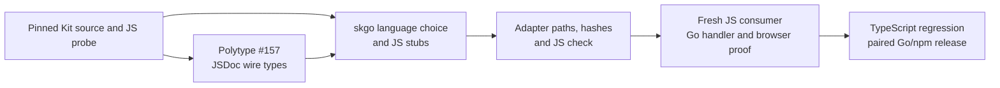

# JavaScript/JSDoc generation: project plan

The completed Gimbal [`research-document` findings](findings.md) and [five-topic semantic index](corpus/INDEX.md) cover the pinned Kit source, skgo, Polytype v1.1.0, and disposable JavaScript app probes. This plan distinguishes source contracts, observed behavior, and work still to prove.

## Desired result

A developer who chooses JavaScript with JSDoc in `skgo new` receives skgo-owned frontend output in JavaScript: named wire types in `types.js`, remote modules in `.remote.js`, and Go-backed load/action/endpoint stubs in `+page.server.js`, `+layout.server.js`, and `+server.js`. Declarations have JSDoc types so `checkJs` preserves inference through Svelte components and imports. The bodies still throw if executed; Go answers every server request. Generated Kit `.d.ts` files and the TypeScript checker remain legitimate tooling in a JavaScript app.

## What Kit already permits

- Pinned Kit `3.0.0-next.28` recognizes `[/.]remote\.[^/]+$`, which includes `.remote.js` ([`src/exports/vite/utils.js:144-164`](/Users/tyler/src/skgo/ephemeral/inspiration/reference/kit@3.0.0-next.28/src/exports/vite/utils.js)). Its remote plugin hashes the Vite-root-relative source path, including the extension, then uses that hash for the compiled chunk and `<hash>/<name>` remote ID ([`src/exports/vite/plugins/remote.js:97-136`](/Users/tyler/src/skgo/ephemeral/inspiration/reference/kit@3.0.0-next.28/src/exports/vite/plugins/remote.js)). Thus `.remote.ts` to `.remote.js` changes the ID even when the export name stays the same. See [`topic-001/INDEX.md`](corpus/topic-001/INDEX.md).
- Kit reads *runtime* exports to register remote functions. A JavaScript JSDoc type must not become a runtime export from a remote module; `export type` has no JavaScript syntax and a plain `export` of a type would violate Kit's remote-export contract ([`plugins/remote.js:110-136`](/Users/tyler/src/skgo/ephemeral/inspiration/reference/kit@3.0.0-next.28/src/exports/vite/plugins/remote.js)).
- Kit's generated config enables `allowJs` and `checkJs`, and its route-type writer explicitly handles JSDoc in JavaScript route modules ([`write_tsconfig/utils.js:24-25`](/Users/tyler/src/skgo/ephemeral/inspiration/reference/kit@3.0.0-next.28/src/core/sync/write_tsconfig/utils.js), [`write_types/index.js:703-863`](/Users/tyler/src/skgo/ephemeral/inspiration/reference/kit@3.0.0-next.28/src/core/sync/write_types/index.js)). This is a supported Kit mode, not a new Kit feature.

## What skgo currently emits

| Output | Current source | JavaScript mode requirement |
| --- | --- | --- |
| Remote functions | `internal/gen/scan.go:338`, `internal/gen/emit.go:25-179` | Emit `.remote.js` with JSDoc above each exported declaration; keep exact Kit factory call shapes for query, command, form, live, batch and no-argument functions. Preserve throwing bodies. |
| Named wire types | `internal/gen/types.go:364-425` | Emit `types.js` from Polytype's admitted type grammar with exported JSDoc typedefs and stable collision-safe names. No runtime type values. |
| Server loads and actions | `internal/gen/gen.go:309-312`, `internal/gen/loads.go:27-199` | Emit `.server.js` with typed `load` and `actions` declarations, including optional/nullable fields, transported classes, deferred `Promise<T>` fields, and action failure unions. Keep throwing bodies. |
| Endpoints | `internal/gen/endpoints.go:78-116,166-168` | Emit `+server.js` with typed method exports, including `QUERY` and `fallback`, whose bodies throw. |
| Build contract | `internal/gen/emit.go:728-760`, `internal/adapter/skgo-adapter.js:198-262` | Make Go module paths, `skgo.remotes.json`, Kit's compiled paths and adapter comparisons agree on `.js`. Accept `.server.js` in adapter load/action path validation. |
| Frontend check | `internal/check/frontend.go:116-117` | Select `jsconfig.json` for JavaScript apps; run `svelte-check` with `checkJs`, and reject deliberately wrong consumer calls. |
| New app | `internal/newapp/newapp.go:302-327` | Carry `sv --types jsdoc` through generation and future regenerate/check commands. Keep TypeScript mode working. |

The current generator has no language field in `gen.Config` ([`internal/gen/gen.go:32-50`](/Users/tyler/.codex/worktrees/ef7a/skgo/internal/gen/gen.go)). `sv --types jsdoc` affects scaffolding only. It neither changes `go generate` nor changes the generated file extensions. See [`topic-002/INDEX.md`](corpus/topic-002/INDEX.md).

## Dependency and release boundary

`go.mod` uses **Polytype v1.1.0**. Its `typescript.Generate` validates `typegrammar.Definitions`, allocates stable names, and emits `types.ts` plus optional `index.ts`; there is no JavaScript/JSDoc output option ([`typescript/generate.go:39-93`](/Users/tyler/go/pkg/mod/github.com/tylergannon/polytype@v1.1.0/typescript/generate.go)). The pinned `reference/polytype` symlink points to older `v1.0.0-rc.9`, so capability claims here use the actual v1.1.0 dependency. [Polytype issue #157](https://github.com/tylergannon/polytype/issues/157) requests a grammar-faithful JSDoc projection and checked-JavaScript proof. skgo should consume that projection rather than invent a second wire-type grammar. See [`topic-003/INDEX.md`](corpus/topic-003/INDEX.md).

The adapter's load/action validation currently names `.server.ts` only ([`skgo-adapter.js:234-246`](/Users/tyler/.codex/worktrees/ef7a/skgo/internal/adapter/skgo-adapter.js)). The adapter also compares generated remote hashes and routes with Kit's build, so changing a suffix on only one side fails. Adapter files have a fingerprint used at generation and startup; changing the adapter therefore requires a matching Go module/npm adapter release, not merely a source edit ([`internal/adapter/adapter.go:87-164`](/Users/tyler/.codex/worktrees/ef7a/skgo/internal/adapter/adapter.go), [`topic-004/INDEX.md`](corpus/topic-004/INDEX.md)). Kit itself does not appear to need a dependency change for `.remote.js` on the pinned version.

For the required full JSDoc check, the JavaScript app still needs TypeScript as a **development checker**: pinned Kit declares an optional `typescript: ^6.0.0` peer and the disposable JS app uses TypeScript 6.0.3 with `svelte-check --tsconfig ./jsconfig.json` ([`kit/package.json:46-59`](/Users/tyler/src/skgo/ephemeral/inspiration/reference/kit@3.0.0-next.28/package.json), [`probe package.json`](/tmp/skgo-jsdoc-jsproof-20260926/web/package.json)). The dependency change is Polytype's new projection and its skgo version bump, not removing TypeScript from tooling.

## What the disposable apps proved

- A fresh `skgo new -- --types jsdoc --template minimal` app built with Kit next.28. Its `pnpm run check` failed on `sv`'s generated Vitest `greet(name)` fixture because the parameter lacked JSDoc. That scaffold issue must be fixed or excluded by the app template before a clean JS-mode check is meaningful.
- A `--types jsdoc --template demo` app, after adding missing JSDoc in the disposable fixture, passed `pnpm run check` and build, and rejected `record(123)` in the JS page. This proves a JavaScript-authored consumer can infer types from **today's generated TypeScript**, not that skgo can emit JavaScript yet.
- In a disposable copy, manually replacing the generated `types.ts`/`example.remote.ts` pair with JSDoc `types.js`/`example.remote.js` passed `pnpm run check` with zero diagnostics; a temporary `record(123)` yielded the expected string-versus-number error. I reran those checks after Gimbal indexing: the good app exited 0 with zero errors/warnings; the bad call exited 1 with the `number`-versus-`string` diagnostic, and the file was restored. A top-level JSDoc `Status` alias in the `.remote.js` module was accessible as `import('./example.remote.js').Status`; a bad `writes: string` assignment failed while a correct value passed. Both probes were removed. `pnpm run build` then exited 0 and Kit compiled `.remote.js` into `remote-2b61k.js`. Earlier, with stale `.ts` ID `1ptltty`, the adapter failed its generated-versus-compiled hash comparison. After aligning the disposable remote manifest and Go binding path, the Go binary served HTTP 200 SSR markup, and `/_app/remote/2b61k/status` returned JSON from Go. The HTTP probe and stale-hash failure were directly observed earlier in the operator session; the Gimbal probe researcher only inspected resulting files and had no saved stdout logs. See [`topic-005/INDEX.md`](corpus/topic-005/INDEX.md) for artifact boundaries.

The manual probe did not exercise automatic JS generation, server loads/actions/endpoints, browser navigation/hydration, both dev and production modes, or TypeScript regression. Those are acceptance work, not demonstrated results.

## Execution order and acceptance

1. **Polytype projection** — resolve #157 with checked-JavaScript consumer tests over the same admitted grammar as the TypeScript backend. Assert correct values and negative diagnostics for nested fields, enum/discriminator values, recursion and naming collisions.
2. **skgo language selection and emitters** — make the `jsdoc` choice durable for regenerate/check; emit only skgo-owned `.js` frontend artifacts in that mode, with JSDoc on every public declaration. Preserve Go handler ownership and the exact Kit factory/export semantics. Switching modes removes only obsolete generator-owned files and leaves authored files alone.
3. **Adapter and check integration** — accept the generated `.js` route paths, keep remote IDs derived from the exact compiled path, select the app's JS config, and pair the adapter package with the Go release.
4. **Consumer proof** — generate a fresh JS app with named wire types, every remote kind, load/action/endpoint, and an imported transported class. `pnpm run check` has zero errors; deliberately wrong calls produce specific diagnostics. `just test` proves Go handler bytes; `just e2e` exercises Kit's client in both modes where browser behavior matters; inspect the rendered page. Repeat the existing TypeScript path to catch regressions.

**Source-sensitive limits:** JSDoc expression syntax and inference for each remote kind should be established by a checked consumer fixture before choosing emitter templates. In particular, type-only exposure from a `.remote.js` module must not add a runtime export, and a `never`-typed throwing helper alone may not provide the desired public remote signature. The focused prototype showed a `RemoteCommand`/`RemoteQueryFunction` annotation working for two functions; it did not establish all factory overloads.
